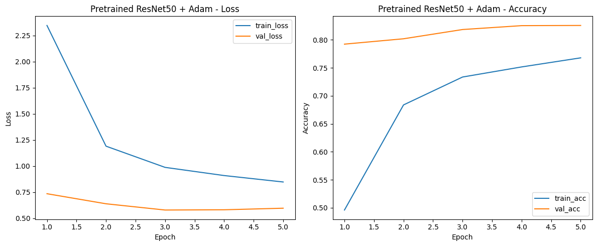
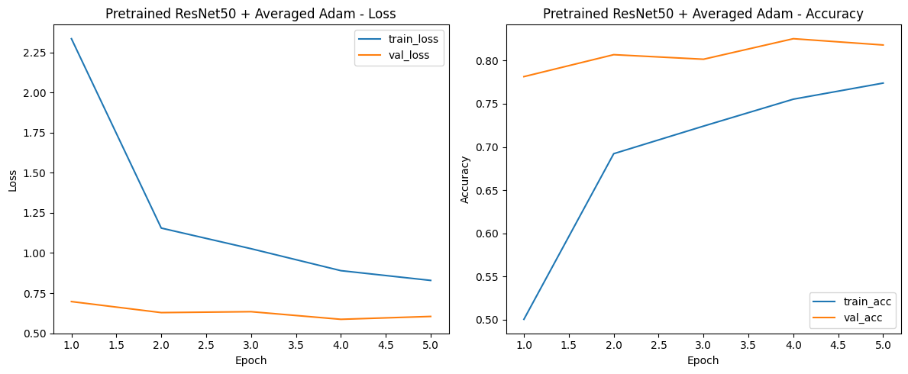
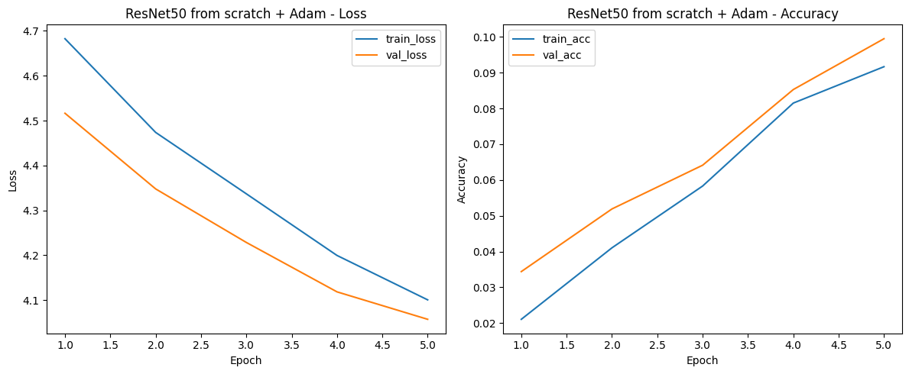

# Лабораторная работа: классификация Stanford Dogs Dataset с использованием ResNet50

## Цель работы

Научиться реализовывать алгоритм глубокого обучения для многоклассовой классификации изображений с использованием архитектуры ResNet50.

## Постановка задачи

В работе использовался Stanford Dogs Dataset. Датасет был разделён на обучающую, валидационную и тестовую выборки в соотношении 70/15/15.

Были проведены три эксперимента:

1. Дообучение предобученной модели ResNet50 с оптимизатором Adam.
2. Дообучение предобученной модели ResNet50 с оптимизатором Averaged Adam.
3. Обучение модели ResNet50 с нуля с оптимизатором Adam.

Сравнение выполнялось по метрикам Precision, Recall и F1-score.

## Датасет

Использовался Stanford Dogs Dataset — набор изображений собак различных пород.

Разделение датасета:
- train — 70%
- val — 15%
- test — 15%

Для загрузки данных использовалась структура папок, совместимая с `torchvision.datasets.ImageFolder`.

## Предобработка и аугментации

Для обучающей выборки использовались следующие преобразования:
- `RandomResizedCrop(224)`
- `RandomHorizontalFlip()`
- преобразование в тензор
- нормализация по статистикам ImageNet

Для валидационной и тестовой выборок использовались:
- `Resize((224, 224))`
- преобразование в тензор
- нормализация

## Архитектура модели

В работе использовалась архитектура ResNet50.

В предобученных экспериментах использовались веса ImageNet. Последний полносвязный слой модели был заменён на слой с количеством выходов, равным числу классов Stanford Dogs Dataset.

## Проведённые эксперименты

1. **Pretrained ResNet50 + Adam**
2. **Pretrained ResNet50 + Averaged Adam**
3. **ResNet50 from scratch + Adam**

## Результаты

| Experiment | Precision | Recall | F1 |
|---|---:|---:|---:|
| Pretrained + Adam | 0.8350 | 0.8216 | 0.8203 |
| Pretrained + Averaged Adam | 0.8598 | 0.8496 | 0.8481 |
| From scratch + Adam | 0.0652 | 0.0571 | 0.0397 |

## Графики обучения

### Experiment 1 — Pretrained ResNet50 + Adam

### Experiment 2 — Pretrained ResNet50 + Averaged Adam

### Experiment 3 — ResNet50 from scratch + Adam

## Файлы проекта

- `stanford_dogs_resnet50_lab.ipynb` — основной ноутбук с кодом
- `results/final_results.csv` — итоговая таблица результатов
- `results/exp1_plot.png` — график обучения для эксперимента 1
- `results/exp2_plot.png` — график обучения для эксперимента 2
- `results/exp3_plot.png` — график обучения для эксперимента 3

## Вывод

В ходе работы была реализована многоклассовая классификация изображений на датасете Stanford Dogs Dataset с использованием архитектуры ResNet50.

Были проведены три эксперимента: дообучение предобученной модели с оптимизатором Adam, дообучение предобученной модели с оптимизатором Averaged Adam и обучение модели с нуля с оптимизатором Adam.

По результатам экспериментов было установлено, что предобученные модели показывают значительно более высокое качество по сравнению с обучением с нуля. Это объясняется использованием весов ImageNet, которые позволяют модели быстрее извлекать полезные визуальные признаки и эффективнее адаптироваться к новой задаче.

Лучший результат по метрике F1 показал эксперимент **Pretrained ResNet50 + Averaged Adam**:
- Precision = 0.8598
- Recall = 0.8496
- F1 = 0.8481

Эксперимент **Pretrained ResNet50 + Adam** также показал высокий результат, однако оказался немного хуже по всем трём метрикам по сравнению с вариантом с Averaged Adam.

Модель **ResNet50 from scratch + Adam** показала крайне низкое качество:
- Precision = 0.0652
- Recall = 0.0571
- F1 = 0.0397

Это говорит о том, что обучение с нуля на данном датасете и при выбранном числе эпох существенно уступает дообучению предобученной модели.

Таким образом, наиболее эффективным подходом в данной работе оказалось **дообучение предобученной ResNet50 с использованием Averaged Adam**.
